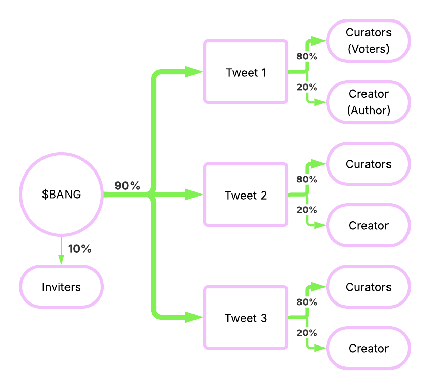

# Rewards

Every 24 hours at midnight UTC, new BANG tokens are minted and distributed based on activity in the last 24 hours. Claim your rewards at anytime. 10% of unclaimed rewards are burned every 7 days they are left unclaimed.

90% of new BANG tokens go to tweets (Tweet Rewards). For each tweet's reward, 80% goes to voters (Curator Rewards) and 20% goes to the tweet author (Creator Rewards).

10% of new BANG tokens go to inviters (Inviter Rewards).

<figure><figcaption></figcaption></figure>

## Tweet Rewards

_Tweets that get more voters with higher conviction earn more rewards_

### **Tweet's net impact:**

`TweetNetImpact = TweetUpImpact - TweetDownImpact`

`TweetUpImpact = (Normalized(UniqueUpvoters) ^ 1.5) * 0.7 +`\
`(Normalized(AvgUpConviction) ^ 1.5) * 0.2 +`\
`Normalized(Power) * 0.1`

`TweetDownImpact = (Normalized(UniqueDownvoters) ^ 1.5) * 0.7 + (Normalized(AvgDownConviction) ^ 1.5) * 0.2 +`\
`Normalized(Power) * 0.1`

### **Tweet's effective impact:**

if TweetNetImpact > 0,

`TweetEffectiveImpact = TweetNetImpact`

else if TweetNetImpact < 0,

`TweetEffectiveImpact = TweetUpImpact * 0.5`

If a tweet's Net Impact is negative, then downvoters are rewarded based on 50% of the Positive Impact of the tweet. This encourages only downvoting over-upvoted slop, instead of dogpiling onto obviously bad tweets, which earns no rewards.

### **Tweet's reward share:**

`TweetRewards = (TweetEffectiveImpact / TotalEffectiveImpact) * (TotalRewards * 0.9)`

## Curator Rewards

_Voters that vote for top tweets harder and earlier earn more rewards_

Only the "winning" side voters of a tweet's Net Impact is rewarded.

### **Voter's taste:**

`UpvoterTaste = SUM[`\
`(Normalized(Earliness) ^ 1.5) * 0.45 +`\
`(Normalized(Conviction) ^ 1.5) * 0.45 +`\
`* Normalized(Power)`\
`] for all voter's upvotes on that tweet`

`DownvoterTaste = SUM[`\
`(Normalized(Earliness) ^ 1.5) * 0.45 +`\
`(Normalized(Conviction) ^ 1.5) * 0.45 +`\
`* Normalized(Power)`\
`] for all voter's downvotes on that tweet`

### **Voter's share of a tweet's rewards:**

If TweetNetImpact > 0,

`CuratorRewards = (UpvoterTaste / TotalUpvoteTaste) * (TweetRewards * 0.8)`

If TweetNetImpact < 0,

`CuratorRewards = (DownvoterTaste / TotalDownvoteTaste) * (TweetRewards * 0.8)`

## Creator Rewards

_Authors whose tweets get more upvoters with higher conviction earn more rewards_

Creator Rewards for authors of negative Net Impact tweets get re-distributed to authors of positive Net Impact tweets.

### **Author's clout:**

`AuthorClout = AuthorRewardBoost * SUM[TweetRewards] for all authored tweets with TweetNetImpact > 0 in period`

### **Author's share of rewards:**

`AuthorRewards = (AuthorClout / TotalClout) * (SUM[TweetRewards * 0.2] for all authored tweets with TweetNetImpact > 0 in period)`

## Inviter Rewards

_Inviters whose invitees vote for top tweets harder and earlier earn more rewards_

### **Inviter's relationship degree factor:**

`InviteDegree = 5 if direct invite, 2 if second-degree invite, 1 if third-degree invite`

### **Inviter's connection:**

`InviterConnection = SUM[VoterCuratorRewards * InviteDegree * InviterRewardBoost] for all voters that earned curator rewards in the period`

### **Inviter's share of the 10% of new BANG tokens:**

`InviterRewards = (InviterConnection / TotalConnection) * (TotalRewards * 0.1)`
